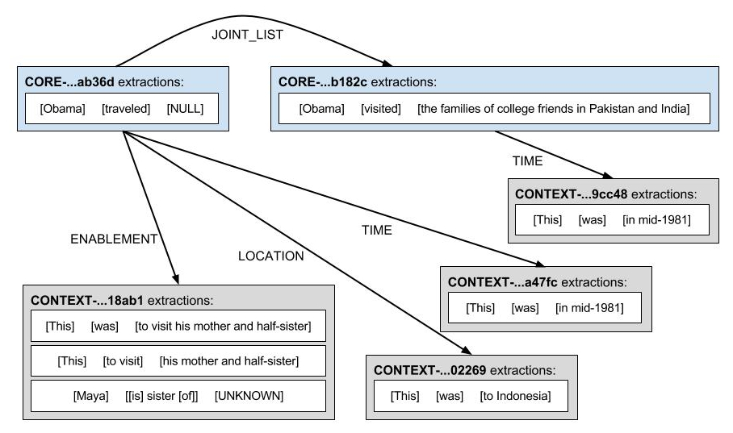
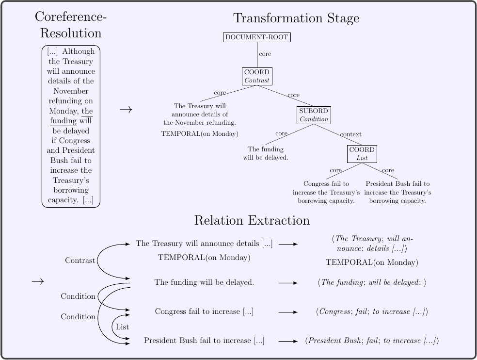

# Knowledge Graph / Open Information Extraction

## Motivation

_Graphene_ is an information extraction pipeline which extracts _Knowledge Graphs_ from texts (n-ary relations and rhetorical structures extracted from complex factoid discourse). Given a sentence or a text, Graphene outputs a semantic representation of the text which is a labeled directed graph (a knowledge graph). This knowledge graph can be later used for addressing different AI tasks, such as building Question Answering systems, extracting structured data from text, supporting semantic inference, among other tasks. Differently from existing open relation extraction tools, which focus on the main relation expressed in a sentence, Graphene aims at maximizing the extraction of contextual relations. For example: 

`Trump withdrew his sponsorship after the second Tour
de Trump in 1990 because his business ventures were
experiencing financial woes.`



In order to capture all the contextual information, Graphene performs the following steps:
* Resolves co-references.
* Transforms complex sentences (for example, containing subordinations, coordinations, appositive phrases, etc), into simple independent sentences (one clause per sentence).
* Identifies rhetorical relations between those sentences
* Extract binary relations (`subject`,  `predicate` and  `object`) from each sentence.
* Merge all the extracted relations into a relation graph (knowledge graph).



Graphene’s extracted graphs are represented by our RDFNL format, an simple format that facilitates the representation of complex contextual relations in a way that balances machine representation with human legibility. A description of the RDFNL format can be found [here](wiki/RDFNL-Format.md).
In order to increase further processability of the extracted relations, Graphene can materialize its relations into a proper RDF graph serialized under the N-Triples specification of the RDF standard. A description of the RDF format can be found [here](wiki/RDF-Format.md).
Alternatively, developers can use the direct output class of the API, which is serializable and deserializable as a JSON object.

## Example Extractions

### Sentence Extraction

`Although the Treasury will announce details of the November refunding on Monday, the funding will be delayed if Congress and President Bush fail to increase the Treasury's borrowing capacity.`

The serialized class: [JSON](wiki/files/example.json)   
The RDFNL format:

```
# Although the Treasury will announce details of the November refunding on Monday , the funding will be delayed if Congress and President Bush fail to increase the Treasury 's borrowing capacity .

bacf06771e0f4fc5a8e68c30fc77c9c4    0    the Treasury    will announce    details of the November refunding
    S:TEMPORAL    on Monday .
    L:CONTRAST    948eeebd73564adab7dee5c6f177b3b9

948eeebd73564adab7dee5c6f177b3b9    0    the funding    will be delayed        
    L:CONDITION 006a71e51295440fab7a8e8c697d2ba6
    L:CONDITION e4d86228cff443b7a8e9f6d8a5c5987b
    L:CONTRAST    bacf06771e0f4fc5a8e68c30fc77c9c4

006a71e51295440fab7a8e8c697d2ba6    1    Congress    fail    to increase the Treasury 's borrowing capacity
    L:LIST    e4d86228cff443b7a8e9f6d8a5c5987b

e4d86228cff443b7a8e9f6d8a5c5987b    1    president Bush    fail    to increase the Treasury 's borrowing capacity
    L:LIST    006a71e51295440fab7a8e8c697d2ba6
```

The RDF N-Triples format: [NT](wiki/files/example.nt)

### Full text extraction of the [Barack Obama Wikipedia Page](https://en.wikipedia.org/wiki/Barack_Obama) (2017-11-06):

The serialized class: [JSON](wiki/files/Barack_Obama_2017_11_06.json)   
The RDFNL format: [RDFNL](wiki/files/Barack_Obama_2017_11_06.rdfnl)   
The RDF N-Triples format: [RDF](wiki/files/Barack_Obama_2017_11_06.nt)   

## Contributors (alphabetical order)
- Andre Freitas
- Bernhard Bermeitinger
- Christina Niklaus
- Leonardo Souza
- Matthias Cetto
- Siegfried Handschuh

## Requirements

* Java 8 (OpenJDK or Oracle)
* Maven 3.3.9
* Docker version 17.03+
* docker-compose version 1.12+

## Dependencies
Compiling and packaging requires two additional packages:

To install [Sentence Simplification](https://github.com/Lambda-3/SentenceSimplification), execute the following script:

	./install-SentenceSimplification.sh

To install [Discourse Simplification](https://github.com/Lambda-3/DiscourseSimplification), execute the following script:

    ./install-DiscourseSimplification.sh

## Setup of Graphene

Graphene can be customized via configuration file. The default settings are specified in `graphene-core/src/main/resources/reference.conf`.
You can overwrite these settings in the corresponding `src/main/java/resources/application.conf` file for each module (**graphene-core** / **graphene-server** / **graphene-cli**).

(Optional:) If you want to use [PyCobalt](https://github.com/Lambda-3/PyCobalt.git) as the preferred coreference resolution system, you must have a [PyCobalt](https://github.com/Lambda-3/PyCobalt.git) instance running. It is provided in the `docker-compose-core.yml`.
Start it with `docker-compose -f docker-compose-core.yml up`.
Ensure that the `PyCobaltCoref` class is selected and the coreference url of [PyCobalt](https://github.com/Lambda-3/PyCobalt.git) is set correctly in your `application.conf`:
```
graphene {
    coreference.resolver = org.lambda3.graphene.core.coreference.impl.pycobalt.PyCobaltCoref
    coreference.settings.pycobalt.url = "http://localhost:5128/resolve"
}
```

You need to install the Graphene-Core API with:

	mvn clean install -DskipTests

Graphene can be used as a **Java API**, as a **Web Service**, or as a **Command Line Interface**.

### REST-Like Web Service (Graphene-Server)

If you want the server part, you have to specify that profile:

    mvn -P server clean package -DskipTests

### Command Line Interface (Graphene-CLI)

If you want the command line part, you have to specify that profile:

    mvn -P cli clean package -DskipTests   

### Both

To build both interfaces, you can specify both profiles:

    mvn -P cli -P server clean package -DskipTests

### Video Tutorial
A short video tutorial on the Graphene setup for CLI usage is provided [here](https://asciinema.org/a/bvhgIP8ZEgDwtmRPFctHyxALu?speed=3). Note that the command line arguments for Relation Extraction used in this video are outdated. Please refer to the newest set of commands [here](wiki/Graphene-CLI.md).

## Setup of Graphene-Server using Docker-Compose

For simplified deployment, we have wrapped Graphene's web service including all needed dependencies (e.g. [PyCobalt](https://github.com/Lambda-3/PyCobalt.git)) into a Docker image.
The configuration settings for the Docker image are customized in `conf/graphene.conf` which will overwrite the default settings from `graphene-core/src/main/resources/reference.conf`.
Ensure that the coreference url for [PyCobalt](https://github.com/Lambda-3/PyCobalt.git) in your `conf/graphene.conf` is set to:
```
graphene {
    coreference.settings.pycobalt.url = "http://coreference:5128/resolve"
}
```

Ensure that you have installed the Graphene-Core API and packaged the server part:

    mvn clean install -DskipTests
    mvn -P server clean package -DskipTests

Then, you can build and start the composed images by running:
	
	docker-compose up


## Usage

### Graphene-Core
Graphene comes with a Java API which is described [here](wiki/Graphene-Core.md).

In order to use the Graphene API within your own Java application, you can import it as a Maven dependency.
Just add the following lines to your project's `pom.xml` file:

```
<dependency>
    <groupId>org.lambda3.graphene</groupId>
    <artifactId>graphene-core</artifactId>
    <version>3.1.0</version>
</dependency>
```

### Graphene-Sever
The usage of the Graphene-Server is described [here](wiki/Graphene-Server.md).


### Graphene-CLI
The usage of Graphene's command-line interface is described [here](wiki/Graphene-CLI.md).


## Citation
	@InProceedings{cetto2018graphene,
	  author    = {Matthias Cetto and Christina Niklaus and Andr\'{e} Freitas and Siegfried Handschuh},
	  title     = {Graphene: Semantically-Linked Propositions in Open Information Extraction},
	  booktitle = {Proceedings of the 27th International Conference on Computational Linguistics},
	  year      = {2018},
	  publisher = {Association for Computational Linguistics},
  	  pages     = {2300--2311},
	  location  = {Santa Fe, New Mexico, USA},
 	  url 	    = {http://aclweb.org/anthology/C18-1195}
	} 

