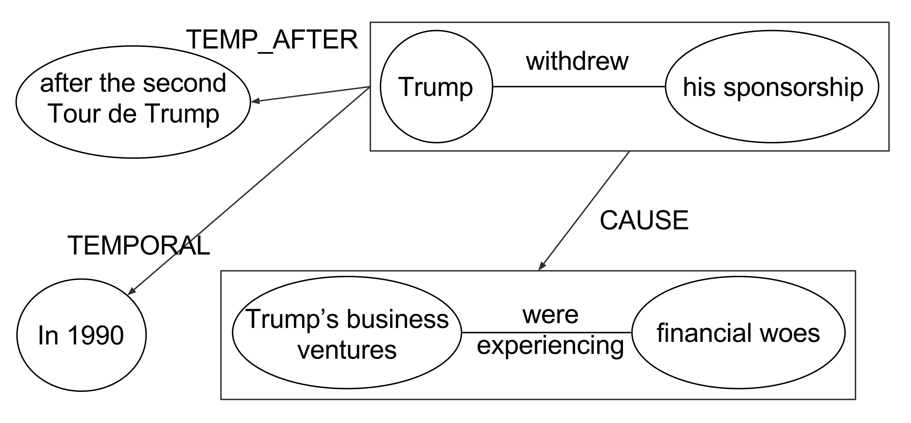

# Graphene: Knowledge Graph / Open Relation Extraction

## Motivation

_Graphene_ is an information extraction pipeline which extracts _Knowledge Graphs_ from texts (n-ary relations and rhetorical structures extracted from complex factoid discourse). Given a sentence or a text, Graphene outputs a semantic representation of the text which is a labeled directed graph (a knowledge graph). This knowledge graph can be later used for addressing different AI tasks, such as building Question Answering systems, extracting structured data from text, supporting semantic inference, among other tasks. Differently from existing open relation extraction tools, which focus on the main relation expressed in a sentence, Graphene aims at maximizing the extraction of contextual relations. For example: 

`Trump withdrew his sponsorship after the second Tour
de Trump in 1990 because his business ventures were
experiencing financial woes.`



In order to capture all the contextual information, Graphene performs the following steps:
* Resolves co-references.
* Transforms complex sentences (for example, containing subordinations, coordinations, appositive phrases, etc), into simple independent sentences (one clause per sentence).
* Identifies rhetorical relations between those sentences
* Extract binary relations (`subject`,  `predicate` and  `object`) from each sentence.
* Merge all the extracted relations into a relation graph (knowledge graph).

Graphene’s extracted graphs are represented by our RDFNL format, an simple format that facilitates the representation of complex contextual relations in a way that balances machine representation with human legibility. A description of the RDFNL format can be found [here](wiki/RDFNL-Format.md).
In order to increase further processability of the extracted relations, Graphene can materialize its relations into a proper RDF graph serialized under the N-Triples specification of the RDF standard. A description of the RDF format can be found [here](wiki/RDF-Format.md).
Alternatively, developers can use the direct output class of the API, which is serializable and deserializable as a JSON object.

## Example Extractions

### Sentence Extraction

`The café arrived in Paris in the 17th century , when the beverage was first brought from Turkey , and by the 18th century Parisian cafés were centres of the city 's political and cultural life .`

The serialized class: [JSON](wiki/files/example.json)   
The RDFNL format:

```
# The café arrived in Paris in the 17th century , when the beverage was first brought from Turkey , and by the 18th century Parisian cafés were centres of the city 's political and cultural life .
 
3469c5159933484a8bbdb5b1df36136f    0    The café    arrived    in Paris in the 17th century
    ELEM-BACKGROUND    fcbcb5c547f248cc88f8aa3033178d12
 
fcbcb5c547f248cc88f8aa3033178d12    1    The beverage    was first brought    
    VCON-SPATIAL    from Turkey .
 
394d55aacc064bcc82912689dc0500b9    0    Parisian cafés    were    centres of the city 's political and cultural life
    VCON-TEMPORAL    by the 18th century .
```

The RDF N-Triples format:

```
# The café arrived in Paris in the 17th century , when the beverage was first brought from Turkey , and by the 18th century Parisian cafés were centres of the city 's political and cultural life .
 
_:65e72e14ff3f4e9bb173afd10a84050a <http://lambda3.org/graphene/sentence#original-text> "The café arrived in Paris in the 17th century , when the beverage was first brought from Turkey , and by the 18th century Parisian cafés were centres of the city 's political and cultural life ."^^<http://www.w3.org/2001/XMLSchema#string> .
 
_:65e72e14ff3f4e9bb173afd10a84050a <http://lambda3.org/graphene/sentence#has-extraction> _:fcbcb5c547f248cc88f8aa3033178d12 .
_:fcbcb5c547f248cc88f8aa3033178d12 <http://lambda3.org/graphene/extraction#subject> <http://lambda3.org/graphene/text#The+beverage> .
_:fcbcb5c547f248cc88f8aa3033178d12 <http://lambda3.org/graphene/extraction#predicate> <http://lambda3.org/graphene/text#was+first+brought> .
_:fcbcb5c547f248cc88f8aa3033178d12 <http://lambda3.org/graphene/extraction#object> <http://lambda3.org/graphene/text#> .
_:fcbcb5c547f248cc88f8aa3033178d12 <http://lambda3.org/graphene/extraction#context-layer> "1"^^<http://www.w3.org/2001/XMLSchema#integer> .
<http://lambda3.org/graphene/text#The+beverage> <http://www.w3.org/1999/02/22-rdf-syntax-ns#value> "The beverage"^^<http://www.w3.org/2001/XMLSchema#string> .
<http://lambda3.org/graphene/text#was+first+brought> <http://www.w3.org/1999/02/22-rdf-syntax-ns#value> "was first brought"^^<http://www.w3.org/2001/XMLSchema#string> .
<http://lambda3.org/graphene/text#> <http://www.w3.org/1999/02/22-rdf-syntax-ns#value> ""^^<http://www.w3.org/2001/XMLSchema#string> .
_:fcbcb5c547f248cc88f8aa3033178d12 <http://lambda3.org/graphene/extraction#VCON-SPATIAL> <http://lambda3.org/graphene/text#from+Turkey+.> .
<http://lambda3.org/graphene/text#from+Turkey+.> <http://www.w3.org/1999/02/22-rdf-syntax-ns#value> "from Turkey ."^^<http://www.w3.org/2001/XMLSchema#string> .
 
_:65e72e14ff3f4e9bb173afd10a84050a <http://lambda3.org/graphene/sentence#has-extraction> _:3469c5159933484a8bbdb5b1df36136f .
_:3469c5159933484a8bbdb5b1df36136f <http://lambda3.org/graphene/extraction#subject> <http://lambda3.org/graphene/text#The+caf%C3%A9> .
_:3469c5159933484a8bbdb5b1df36136f <http://lambda3.org/graphene/extraction#predicate> <http://lambda3.org/graphene/text#arrived> .
_:3469c5159933484a8bbdb5b1df36136f <http://lambda3.org/graphene/extraction#object> <http://lambda3.org/graphene/text#in+Paris+in+the+17th+century> .
_:3469c5159933484a8bbdb5b1df36136f <http://lambda3.org/graphene/extraction#context-layer> "0"^^<http://www.w3.org/2001/XMLSchema#integer> .
<http://lambda3.org/graphene/text#The+caf%C3%A9> <http://www.w3.org/1999/02/22-rdf-syntax-ns#value> "The café"^^<http://www.w3.org/2001/XMLSchema#string> .
<http://lambda3.org/graphene/text#arrived> <http://www.w3.org/1999/02/22-rdf-syntax-ns#value> "arrived"^^<http://www.w3.org/2001/XMLSchema#string> .
<http://lambda3.org/graphene/text#in+Paris+in+the+17th+century> <http://www.w3.org/1999/02/22-rdf-syntax-ns#value> "in Paris in the 17th century"^^<http://www.w3.org/2001/XMLSchema#string> .
_:3469c5159933484a8bbdb5b1df36136f <http://lambda3.org/graphene/extraction#ELEM-BACKGROUND> _:fcbcb5c547f248cc88f8aa3033178d12 .
 
_:65e72e14ff3f4e9bb173afd10a84050a <http://lambda3.org/graphene/sentence#has-extraction> _:394d55aacc064bcc82912689dc0500b9 .
_:394d55aacc064bcc82912689dc0500b9 <http://lambda3.org/graphene/extraction#subject> <http://lambda3.org/graphene/text#Parisian+caf%C3%A9s> .
_:394d55aacc064bcc82912689dc0500b9 <http://lambda3.org/graphene/extraction#predicate> <http://lambda3.org/graphene/text#were> .
_:394d55aacc064bcc82912689dc0500b9 <http://lambda3.org/graphene/extraction#object> <http://lambda3.org/graphene/text#centres+of+the+city+%27s+political+and+cultural+life> .
_:394d55aacc064bcc82912689dc0500b9 <http://lambda3.org/graphene/extraction#context-layer> "0"^^<http://www.w3.org/2001/XMLSchema#integer> .
<http://lambda3.org/graphene/text#Parisian+caf%C3%A9s> <http://www.w3.org/1999/02/22-rdf-syntax-ns#value> "Parisian cafés"^^<http://www.w3.org/2001/XMLSchema#string> .
<http://lambda3.org/graphene/text#were> <http://www.w3.org/1999/02/22-rdf-syntax-ns#value> "were"^^<http://www.w3.org/2001/XMLSchema#string> .
<http://lambda3.org/graphene/text#centres+of+the+city+%27s+political+and+cultural+life> <http://www.w3.org/1999/02/22-rdf-syntax-ns#value> "centres of the city 's political and cultural life"^^<http://www.w3.org/2001/XMLSchema#string> .
_:394d55aacc064bcc82912689dc0500b9 <http://lambda3.org/graphene/extraction#VCON-TEMPORAL> <http://lambda3.org/graphene/text#by+the+18th+century+.> .
<http://lambda3.org/graphene/text#by+the+18th+century+.> <http://www.w3.org/1999/02/22-rdf-syntax-ns#value> "by the 18th century ."^^<http://www.w3.org/2001/XMLSchema#string> .
```

### Full text extraction of the [Barack Obama Wikipedia Page](https://en.wikipedia.org/wiki/Barack_Obama) (2017-05-05):

The serialized class: [JSON](wiki/files/Barack_Obama_2017-05-05.json)   
The RDFNL format: [RDFNL](wiki/files/Barack_Obama_2017-05-05.rdfnl)   
The RDF N-Triples format: [RDF](wiki/files/Barack_Obama_2017-05-05.nt)   

## Contributors (alphabetical order)
- Andre Freitas
- Bernhard Bermeitinger
- Christina Niklaus
- Leonardo Souza
- Matthias Cetto
- Siegfried Handschuh

## Requirements

* Java 8 (OpenJDK or Oracle)
* Maven 3.3.9
* Docker version 17.03+
* docker-compose version 1.12+

## Setup
Compiling and packaging requires two additional packages:

### Sentence Simplification
	cd /tmp
	wget https://github.com/Lambda-3/SentenceSimplification/archive/v5.0.0.tar.gz -O SentenceSimplification.tar.gz
	tar xfa SentenceSimplification.tar.gz
	cd SentenceSimplification
	mvn -DskipTests install

### Discourse Simplification
	cd /tmp
	wget https://github.com/Lambda-3/DiscourseSimplification/archive/v6.0.0.tar.gz -O DiscourseSimplification.tar.gz
	tar xfa DiscourseSimplification.tar.gz
	cd DiscourseSimplification
	mvn -DskipTests install

### More dependencies (requires [docker](https://www.docker.com/))
Prior to running `Graphene`, two additional dependencies must be met:

* [CoreNLP](https://github.com/Lambda-3/CoreNLP.git)
* [PyCobalt](https://github.com/Lambda-3/PyCobalt.git)

Both are provided with the docker images:
* [CoreNLP](https://hub.docker.com/r/lambdacube/corenlp/)
* [PyCobalt](https://hub.docker.com/r/lambdacube/pycobalt/)


### Setup of Graphene
Graphene-Core is build with

	mvn clean package -DskipTests

If you want the server part, you have to specify that profile:

    mvn -P server clean package -DskipTests

If you want the command line part, you have to specify that profile:

    mvn -P cli clean package -DskipTests
   
To build both interfaces, you can specify both profiles:

    mvn -P cli -P server clean package -DskipTests

### Docker-Compose

Create a new config file and adjust your settings:

	touch conf/graphene.conf

Then, you can build and start the composed images:
	
	docker-compose up

## Usage

### Graphene-Core
Graphene comes with a Java API which is described [here](wiki/Graphene-Core.md).
You must have a PyCobalt instance running, it is provided in the `docker-compose-core.yml`. Start it with `docker-compose -f docker-compose-core.yml`. You must then change the config file:
```
graphene {
	coreference.url = "http://localhost:5128/resolve"
}
```

### Graphene-Sever
For simplified access, we wrapped the Graphene-Core library inside a REST-like web-service.
```bash
docker-compose up
```
The usage of the Graphene-Server is described [here](wiki/Graphene-Server.md).


## Graphene-CLI
Another way of accessing our service is provided by a command-line interface, which is described [here](wiki/Graphene-CLI.md).
Like the Graphene-Core setup, you must have a PyCobalt instance running before.
